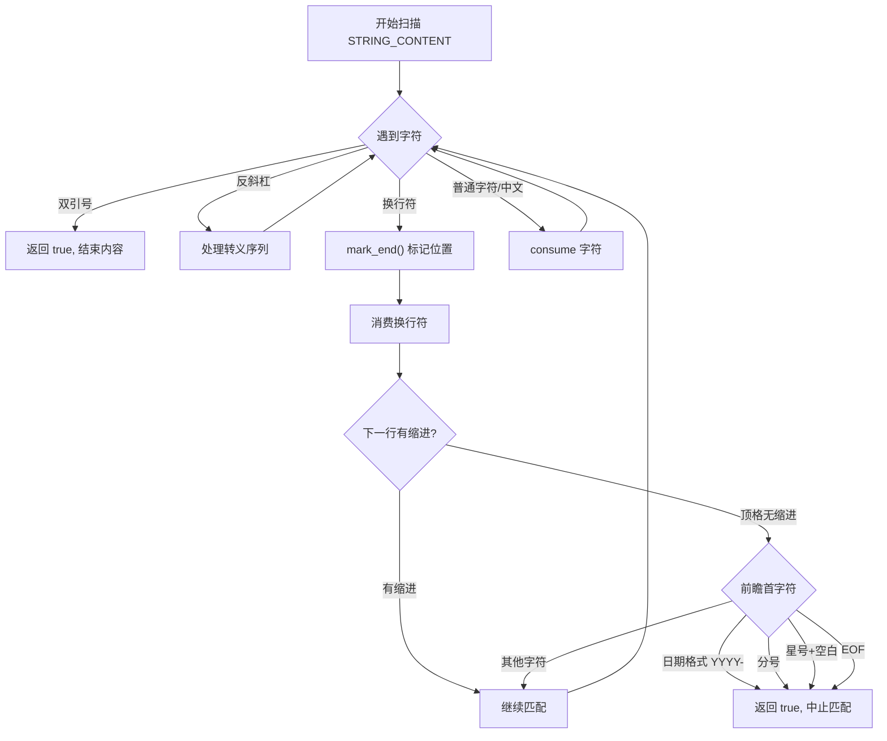

# Tree-sitter Beancount 未闭合字符串错误恢复

## 1. 问题背景

当前字符串定义 (`grammar.js` 第106行):

```javascript
string: $ => token(/"([^"]|\\")*"/),
```

这个正则的 `[^"]` 会匹配任何非引号字符（包括换行符），导致贪婪匹配跨越多行，吞噬后续代码。

## 2. 核心解决方案

在外部扫描器中新增 `STRING_CONTENT` token 类型，在解析字符串内容时遇到换行符进行前瞻检查，根据下一行首字符决定是否中止字符串匹配。

### 2.1 关键洞察

**Beancount 所有以数字开头的顶级指令都是日期格式 `YYYY-MM-DD` 或 `YYYY/MM/DD`**。因此，我们不应该简单地检测"数字开头"，而应该检测"日期格式开头"，避免误判多行字符串中的普通数字内容。

### 2.2 数据流




### 2.3 前瞻判定矩阵

| 条件 | 判定动作 | 理由 ||-----|---------|------|| 下一行有缩进 | **CONTINUE** | 缩进内容属于当前指令（posting 行或多行字符串内容） || 顶格 + 日期格式 `[12]\d{3}[-/]` | **ABORT** | 保护日期开头的顶级指令 || 顶格 + 分号 `;` | **ABORT** | 保护行注释 || 顶格 + 星号 `*` + 空白 | **ABORT** | 保护 org-mode headline || 顶格 + 其他（字母、普通数字、中文等） | **CONTINUE** | 兼容官方多行字符串 || EOF `\0` | **ABORT** | 文件结束，必须停止 |

### 2.4 日期格式检测说明

日期格式：`[12]\d{3}[-/]`

- 第一位必须是 `1` 或 `2`（年份 1xxx 或 2xxx）
- 后跟三位数字
- 然后是 `-` 或 `/` 分隔符

示例匹配：

- `2026-01-13` ✓ ABORT
- `1999/12/31` ✓ ABORT  
- `100 items` ✗ CONTINUE（不是日期格式）
- `3.14 pie` ✗ CONTINUE

## 3. 详细实施步骤

### 3.1 修改 grammar.js

文件: [`packages/tree-sitter-beancount/grammar.js`](packages/tree-sitter-beancount/grammar.js)**修改 externals 数组 (第15-19行):**

```javascript
externals: ($) => [
    $._stars,
    $._sectionend,
    $._eof,
    $._string_content,  // 新增：字符串内容由外部扫描器处理
],
```

**替换 string 规则 (第106行):**

```javascript
// 旧代码:
// string: $ => token(/"([^"]|\\")*"/),

// 新代码:
string: $ => seq('"', optional($._string_content), '"'),
```


### 3.2 扩展 scanner.cc

文件: [`packages/tree-sitter-beancount/src/scanner.cc`](packages/tree-sitter-beancount/src/scanner.cc)

#### 3.2.1 修改 TokenType 枚举 (第10-14行)

```cpp
enum TokenType {
    SECTION,
    SECTIONEND,
    END_OF_FILE,
    STRING_CONTENT,  // 新增
};
```


#### 3.2.2 添加辅助函数

```cpp
// 检测是否为日期开头 (YYYY- 或 YYYY/)
// 只匹配 1xxx 或 2xxx 开头（合理的年份范围）
// 注意：此函数会消费字符进行前瞻，调用前应确保位置已标记
static bool is_date_start(TSLexer *lexer) {
    int32_t c = lexer->lookahead;
    
    // 第一位必须是 '1' 或 '2'
    if (c != '1' && c != '2') {
        return false;
    }
    lexer->advance(lexer, false);
    
    // 后续3位必须是数字
    for (int i = 0; i < 3; i++) {
        c = lexer->lookahead;
        if (c < '0' || c > '9') {
            return false;
        }
        lexer->advance(lexer, false);
    }
    
    // 第5位必须是 '-' 或 '/'
    c = lexer->lookahead;
    return (c == '-' || c == '/');
}

// 检查是否为 org-mode headline（星号后跟空白或更多星号）
static bool is_org_headline(TSLexer *lexer) {
    if (lexer->lookahead != '*') {
        return false;
    }
    lexer->advance(lexer, false);
    int32_t c = lexer->lookahead;
    return (c == ' ' || c == '\t' || c == '*');
}

// 判断顶格行首是否应该中止字符串
static bool should_abort_at_line_start(TSLexer *lexer) {
    int32_t c = lexer->lookahead;
    
    // EOF
    if (c == 0) {
        return true;
    }
    
    // 分号 -> 注释
    if (c == ';') {
        return true;
    }
    
    // 星号 -> 可能是 org-mode headline
    if (c == '*') {
        return is_org_headline(lexer);
    }
    
    // 数字 1 或 2 开头 -> 可能是日期
    if (c == '1' || c == '2') {
        return is_date_start(lexer);
    }
    
    // 其他情况继续匹配
    return false;
}
```


#### 3.2.3 添加字符串内容扫描函数

```cpp
bool scan_string_content(TSLexer *lexer) {
    bool has_content = false;
    
    while (true) {
        int32_t c = lexer->lookahead;
        
        // EOF - 中止匹配
        if (c == 0) {
            break;
        }
        
        // 闭合引号 - 结束内容（不消费引号，留给 grammar）
        if (c == '"') {
            break;
        }
        
        // 转义序列处理
        if (c == '\\') {
            lexer->advance(lexer, false);
            has_content = true;
            // 消费转义字符后面的任意字符（包括 " 和 \）
            if (lexer->lookahead != 0) {
                lexer->advance(lexer, false);
            }
            continue;
        }
        
        // 换行符 - 关键判断点
        if (c == '\n' || c == '\r') {
            // 先标记当前位置为有效结束点（换行符之前）
            lexer->mark_end(lexer);
            
            // 消费换行符
            lexer->advance(lexer, false);
            // 处理 \r\n 组合
            if (c == '\r' && lexer->lookahead == '\n') {
                lexer->advance(lexer, false);
            }
            
            // 检查下一行是否有缩进
            bool has_indent = false;
            while (lexer->lookahead == ' ' || lexer->lookahead == '\t') {
                has_indent = true;
                lexer->advance(lexer, false);
            }
            
            // 如果有缩进，继续匹配（属于当前指令的一部分）
            if (has_indent) {
                lexer->mark_end(lexer);
                has_content = true;
                continue;
            }
            
            // 顶格（无缩进）- 检查是否应该中止
            if (should_abort_at_line_start(lexer)) {
                // 返回到 mark_end 标记的位置（换行符之前）
                // 字符串内容到此为止
                lexer->result_symbol = STRING_CONTENT;
                return has_content;
            }
            
            // 不中止，继续扫描（已经消费了换行符）
            lexer->mark_end(lexer);
            has_content = true;
            continue;
        }
        
        // 普通字符（包括中文等 Unicode 字符）- 消费并继续
        lexer->advance(lexer, false);
        has_content = true;
    }
    
    if (has_content) {
        lexer->mark_end(lexer);
        lexer->result_symbol = STRING_CONTENT;
    }
    return has_content;
}
```


#### 3.2.4 修改 scan 函数

在现有 `scan` 函数中添加 STRING_CONTENT 处理：

```cpp
bool scan(TSLexer *lexer, const bool *valid_symbols) {
    if (in_error_recovery(valid_symbols))
        return false;

    // 新增：处理字符串内容
    if (valid_symbols[STRING_CONTENT]) {
        return scan_string_content(lexer);
    }

    // ... 现有的 section 处理逻辑保持不变 ...
}
```


#### 3.2.5 更新 in_error_recovery 函数

```cpp
static bool in_error_recovery(const bool *valid_symbols) {
    return (valid_symbols[SECTION] && valid_symbols[SECTIONEND]
            && valid_symbols[END_OF_FILE] && valid_symbols[STRING_CONTENT]);
}
```


### 3.3 更新测试用例

#### 3.3.1 更新 no_close_string.txt

文件: [`packages/tree-sitter-beancount/test/corpus/no_close_string.txt`](packages/tree-sitter-beancount/test/corpus/no_close_string.txt)

```javascript
============================
Unclosed string recovery
============================

2026-01-13 * "AAA" "BB"
  Assets:Bank:A 10 USD
  Income:Invest

2026-01-13 * "CCC" "DD
  Assets:Bank:A 1.234 USD
  Income:Invest

2026-01-13 * "AAA" "BB"
  Assets:Bank:A 10 USD
  Income:Invest

---

(file
    (transaction
        (date)
        (txn)
        (payee)
        (narration)
        (posting (account) (incomplete_amount (number) (currency)))
        (posting (account))
    )
    (transaction
        (date)
        (txn)
        (payee)
        (ERROR)
        (posting (account) (incomplete_amount (number) (currency)))
        (posting (account))
    )
    (transaction
        (date)
        (txn)
        (payee)
        (narration)
        (posting (account) (incomplete_amount (number) (currency)))
        (posting (account))
    )
)

============================
Multiline with leading digit (not date)
============================

2026-01-13 * "Count:
100 items in stock"
  Assets:Bank 10 USD

---

(file
    (transaction
        (date)
        (txn)
        (narration)
        (posting (account) (incomplete_amount (number) (currency)))
    )
)

============================
Multiline with indented digit
============================

2026-01-13 * "Count:
  100 items"
  Assets:Bank 10 USD

---

(file
    (transaction
        (date)
        (txn)
        (narration)
        (posting (account) (incomplete_amount (number) (currency)))
    )
)
```


#### 3.3.2 新增 UTF-8 字符串测试

文件: `packages/tree-sitter-beancount/test/corpus/utf8_string.txt`

```javascript
============================
UTF-8 string content
============================

2026-01-13 * "中文商户" "购买商品"
  Assets:Bank 100 CNY
  Expenses:Food

---

(file
    (transaction
        (date)
        (txn)
        (payee)
        (narration)
        (posting (account) (incomplete_amount (number) (currency)))
        (posting (account))
    )
)

============================
UTF-8 multiline string
============================

2026-01-13 * "多行中文
  第二行内容
  第三行"
  Assets:Bank 100 CNY

---

(file
    (transaction
        (date)
        (txn)
        (narration)
        (posting (account) (incomplete_amount (number) (currency)))
    )
)

============================
UTF-8 unclosed string recovery
============================

2026-01-13 * "未闭合中文字符串
  Assets:Bank 100 CNY

2026-01-13 * "下一笔交易" "正常"
  Assets:Bank 200 CNY

---

(file
    (transaction
        (date)
        (txn)
        (ERROR)
        (posting (account) (incomplete_amount (number) (currency)))
    )
    (transaction
        (date)
        (txn)
        (payee)
        (narration)
        (posting (account) (incomplete_amount (number) (currency)))
    )
)

============================
UTF-8 multiline non-indented
============================

2026-01-13 * "第一行
继续第二行"
  Assets:Bank 100 CNY

---

(file
    (transaction
        (date)
        (txn)
        (narration)
        (posting (account) (incomplete_amount (number) (currency)))
    )
)
```


## 4. 完整测试用例矩阵

### 4.1 正常场景 (Must Pass)

| 用例 | 输入 | 预期结果 ||------|------|---------|| 单行字符串 | `"Hello World"` | 正常解析 || 空字符串 | `""` | 正常解析 || 转义引号 | `"Say \"Hi\""` | 正常解析，内容为 `Say "Hi"` || 转义反斜杠 | `"Path: C:\\Users"` | 正常解析 || 中文字符串 | `"中文内容"` | 正常解析 || 中英混合 | `"Buy 苹果"` | 正常解析 || 日文/韩文 | `"日本語テスト"` | 正常解析 || Emoji | `"Hello 🎉"` | 正常解析 |

### 4.2 多行字符串 (Must Pass - 官方兼容)

| 用例 | 输入 | 预期结果 ||------|------|---------|| 缩进多行 | `"Line 1\n  Line 2"` | 正常解析为单个字符串 || 非缩进多行(字母开头) | `"Line 1\nand Line 2"` | 正常解析（兼容官方测试） || 中文多行(缩进) | `"第一行\n  第二行"` | 正常解析 || 中文多行(非缩进) | `"第一行\n继续"` | 正常解析 || **顶格数字(非日期)** | `"Count:\n100 items"` | **正常解析**（改进后） || 缩进数字 | `"Count:\n  100 items"` | 正常解析 |

### 4.3 错误恢复场景 (核心修复)

| 用例 | 输入 | 预期结果 ||------|------|---------|| 未闭合后接日期 | `"DD\n2026-01-13 *` | 字符串在换行处截断，下一行识别为新交易 || 未闭合后接1xxx日期 | `"DD\n1999-12-31 *` | 字符串截断 || 未闭合后接注释 | `"DD\n; comment` | 字符串截断，注释正常 || 未闭合后接 headline | `"DD\n* Section` | 字符串截断，headline 正常 || 未闭合后接多星号 | `"DD\n** SubSection` | 字符串截断 |

### 4.4 边界情况

| 用例 | 输入 | 预期结果 | 说明 ||------|------|---------|------|| 顶格普通数字 | `"Text\n100 items"` | **CONTINUE** | `100` 不是日期格式 || 顶格 3 开头数字 | `"Text\n300 USD"` | **CONTINUE** | `3` 不是 1 或 2 || 顶格 2 开头但非日期 | `"Text\n2x items"` | **CONTINUE** | `2x` 不符合 `\d{4}[-/]` || 缩进日期格式 | `"Text\n  2026-01-13"` | **CONTINUE** | 有缩进，不检查内容 || 多行中间有空行 | `"Line1\n\n  Line2"` | 需验证 | 空行可能被视为顶格 || 文件末尾未闭合 | `"unclosed EOF` | 字符串截断，报错 | EOF 触发 ABORT || 连续转义 | `"\\\\test"` | 正常解析为 `\\test` | || 星号不跟空白 | `"Text\n*bold*"` | **CONTINUE** | 不是 headline || 星号跟空白 | `"Text\n* item"` | **ABORT** | 是 headline |

### 4.5 已知限制 (Accepted Trade-off)

| 用例 | 输入 | 结果 | 说明 ||------|------|------|------|| 顶格字母开头指令 | `"Text\nplugin xxx"` | 继续匹配 | 字母开头不中止，plugin 被吞噬 || 顶格 include | `"Text\ninclude xxx"` | 继续匹配 | 同上 || 顶格 option | `"Text\noption xxx"` | 继续匹配 | 同上 |**权衡说明**: 为了兼容官方多行字符串测试（`"Hello\nand world"`），我们选择不在字母开头时中止。在实际 Beancount 文件中，字符串内容顶格写 `plugin`/`include`/`option` 的概率极低。

## 5. UTF-8 处理说明

### 5.1 Tree-sitter Lexer 的字符处理

`lexer->lookahead` 返回 `int32_t` 类型的 **Unicode 码点 (code point)**，不是字节。

- 中文 '中' → U+4E2D (20013)
- Emoji '🎉' → U+1F389 (127881)
- ASCII 'A' → U+0041 (65)

### 5.2 扫描器中的 Unicode 处理

```cpp
// 所有字符判断使用 Unicode 码点，不是字节
int32_t c = lexer->lookahead;

// 日期检测只检查 ASCII 数字和分隔符
if (c == '1' || c == '2') { /* 可能是日期开头 */ }
if (c >= '0' && c <= '9') { /* ASCII 数字 */ }
if (c == '-' || c == '/') { /* 日期分隔符 */ }

// 所有其他字符（包括中文、日文、Emoji）直接消费
lexer->advance(lexer, false);
```


### 5.3 不需要特殊处理的情况

- 中文字符在字符串内容中 → 直接消费
- 中文字符在行首 → 继续匹配（不是日期/分号/星号）
- 全角数字 `０１２３` → 不触发日期检测（只检查 ASCII）
- 全角分号 `；` → 不触发注释检测

## 6. 实施命令

```bash
cd packages/tree-sitter-beancount

# 1. 修改 grammar.js 和 scanner.cc（手动）

# 2. 重新生成 parser
pnpm run build
# 等价于: tree-sitter generate && tree-sitter build-wasm

# 3. 运行测试
pnpm run test
# 等价于: tree-sitter test

# 4. 如果需要单独测试某个用例
tree-sitter test -f "Unclosed string"
tree-sitter test -f "UTF-8"
tree-sitter test -f "Multiple Lines"
```


## 7. 风险评估

| 风险 | 影响 | 缓解措施 ||------|------|---------|| 破坏现有多行字符串 | 高 | 确保 `multi_line.txt` 测试通过 || 顶格数字误判 | 中 | 改用日期格式检测而非简单数字检测 || 序列化/反序列化兼容性 | 低 | STRING_CONTENT 无状态，不影响序列化 || WASM 构建失败 | 中 | tree-sitter 0.20 以上版本支持 || 性能下降 | 低 | 只在换行时进行前瞻检查 |

## 8. 与原方案的对比

| 方面 | 原方案 | 改进方案 ||------|--------|---------|| 数字检测 | 任意 ASCII 数字 `0-9` | 日期格式 `[12]\d{3}[-/]` || 顶格 `100 items` | 误判为日期，ABORT | 正确识别为非日期，CONTINUE || 顶格 `2026-01-13` | ABORT | ABORT || 缩进检测 | 未明确 | 有缩进则 CONTINUE |